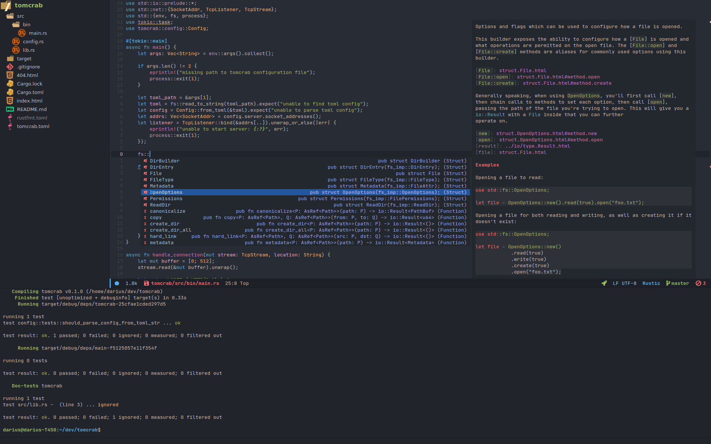

# Personal Doom Emacs configuration



## Prerequisites

### Mandatory

- Git 2.23+
- Emacs 26.1+ (27 is recommended) with GNUTLS support
- [ripgrep](https://github.com/BurntSushi/ripgrep) 11.0+
- [Jetbrains Mono](https://www.jetbrains.com/lp/mono/) font

### Optional

- [fd](https://github.com/sharkdp/fd) 7.3.0+ (improves file indexing performance for some commands)
- CMake 3.10.0+ (vterm)
- [shellcheck](https://github.com/koalaman/shellcheck)
- [marked](https://github.com/markedjs/marked)
- [js-beautify](https://github.com/beautify-web/js-beautify)
- [stylelint](https://github.com/stylelint/stylelint)

## Installation

```sh
cp -r .doom.d ~/
```
