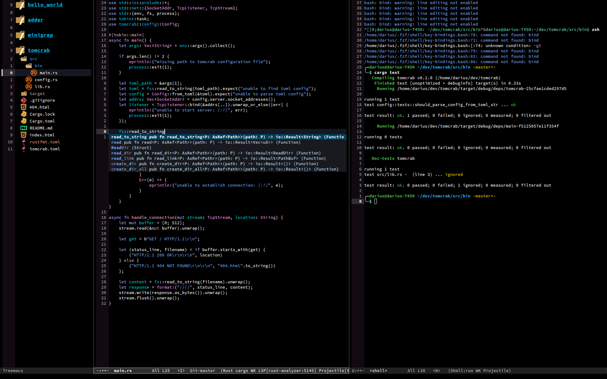

# Personal Emacs configuration



## Prerequisites

- Git 2.23+
- Emacs 26.1+ (27 is recommended) with GNUTLS support
- [ripgrep](https://github.com/BurntSushi/ripgrep) 11.0+
- GNU find
- [Source Code Pro](https://github.com/adobe-fonts/source-code-pro) font

## Installation

```sh
cp -r .emacs.d ~/
```
