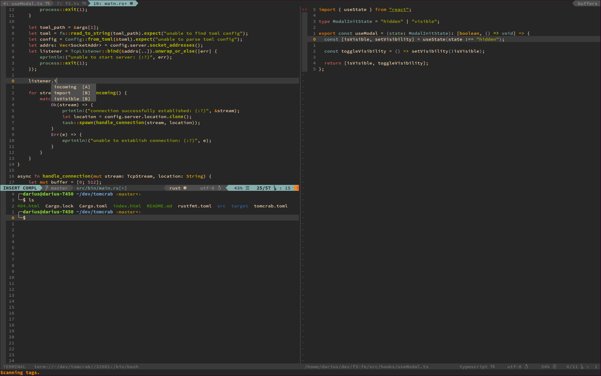

# Personal Vim Configuration

## Installation

`nvim +PlugClean`

`nvim +PlugInstall`

`nvim ~/config/nvim/plugins.vim`

## Configuration

### Visuals

`nvim ~/config/nvim/visuals.vim`

### Plugins

`nvim ~/config/nvim/plugin/<plugin>`
